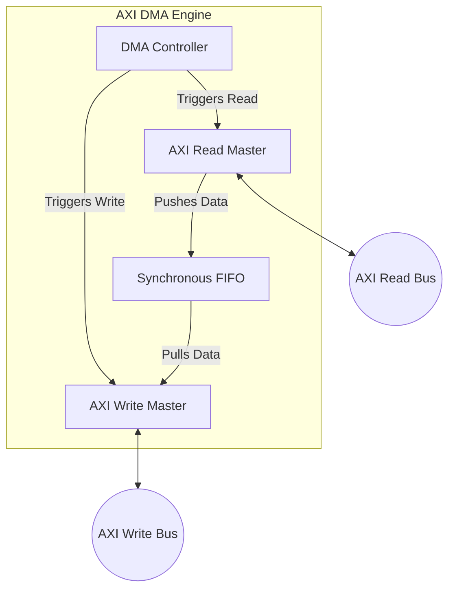
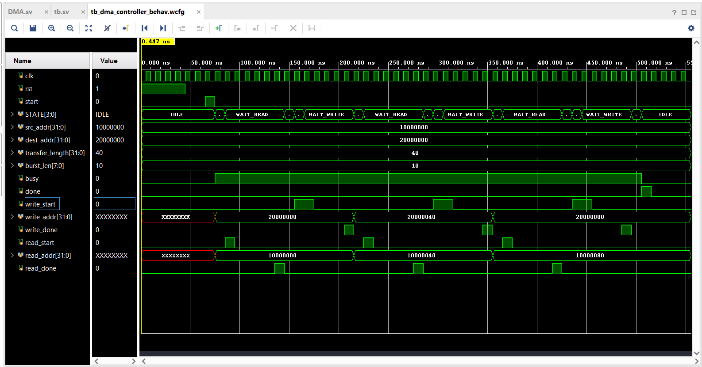
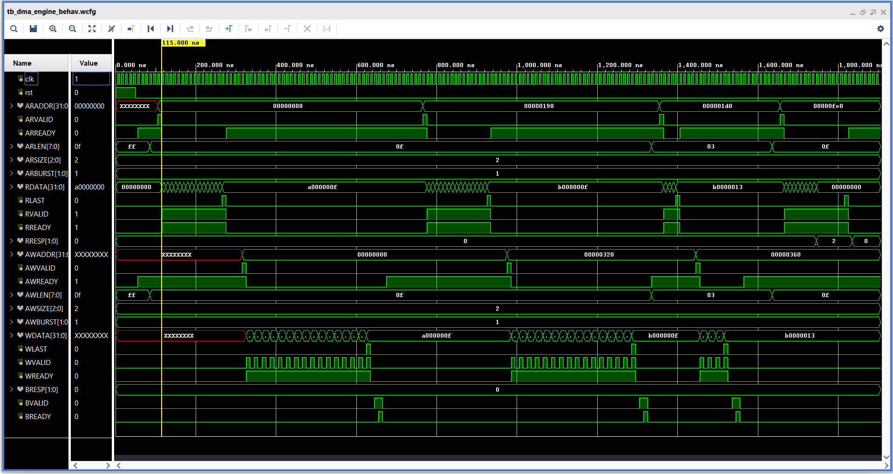

# AXI-Based Direct Memory Access (DMA) Controller

A high-performance, modular SystemVerilog implementation of an **AXI4-compliant Direct Memory Access (DMA) Engine**. This project is designed to transfer blocks of data between different areas of an AXI memory space (e.g., from a source memory address to a destination memory address) without CPU intervention.

---

## Table of Contents
1. [Project Overview](#project-overview)
2. [What is Direct Memory Access (DMA)?](#what-is-direct-memory-access-dma)
3. [System Architecture](#system-architecture)
4. [Understanding AXI4 Protocol: A Quick Reference](#understanding-axi4-protocol-a-quick-reference)
5. [Hardware Components](#hardware-components)
6. [Simulation & Verification](#simulation--verification)
7. [References](#references)

---

## Project Overview

Direct Memory Access (DMA) is a critical component in modern SoC (System-on-Chip) designs, enabling fast block data movement while freeing up the CPU. This project implements a DMA Engine using the ARM AMBA AXI4 protocol. 

### Key Features:
* **AXI4 Compatibility**: Implements standard AXI4 Master and Memory-mapped Slave behavior.
* **Burst Transfer Support**: Fully supports incrementing (`INCR`) bursts with configurable burst lengths.
* **Internal FIFO Buffer**: A dedicated internal synchronous FIFO decouples the read and write clock domains/flows and buffers data during transmission.
* **Automatic Address Incrementing**: The controller automatically computes and increments the source and destination addresses based on the data width and burst sizes.
* **Error Propagation**: Detects memory-space or protocol errors (e.g., `SLVERR` response) and handles them via an error state machine, asserting a top-level error signal.

---

## What is Direct Memory Access (DMA)?

Direct Memory Access (DMA) is a feature of computer systems that allows certain hardware subsystems to access main system memory (RAM) independently of the central processing unit (CPU).

### Why is DMA Needed?
In systems without DMA, whenever a peripheral device (like a network controller, storage interface, or high-speed sensor) needs to transfer data to or from memory, the CPU must actively supervise the entire copy operation. The CPU has to execute a loop reading data from the peripheral's register and writing it to a memory address, word by word (called Programmed Input/Output or PIO).

This is highly inefficient because:
* It consumes valuable CPU execution cycles on a simple, repetitive memory copy task.
* The CPU is blocked from running other software threads or application code during the transfer.
* The throughput is limited by the instruction execution speed of the CPU.

### How Does DMA Solve This?
A DMA controller (DMAC) acts as a specialized hardware unit dedicated solely to transferring data at hardware speed.
1. **CPU Initialization**: The CPU configures the DMA controller with:
   - **Source Address**: Where the data is read from.
   - **Destination Address**: Where the data is written to.
   - **Transfer Length**: The total number of words to copy.
   - **Burst Size/Length**: The length of individual burst transactions on the bus.
2. **Transfer Execution**: The CPU asserts the `start` signal. The DMA controller then takes command of the memory bus, reading from the source and writing to the destination.
3. **CPU Notification**: Once the transfer is completed, the DMA controller asserts a `done` signal (or triggers an interrupt) to inform the CPU. The CPU can then process the moved data.

### DMA Operation in this Project
This project implements a **Memory-to-Memory AXI DMA**. It transfers blocks of data between a source memory space and a destination memory space using the standard AXI4 protocol.
* To decouple the read and write paths and prevent bus stall conditions, it features an **Internal Synchronous FIFO**. 
* The **AXI Read Master** reads data from the source address space and pushes it into the FIFO.
* Simultaneously, the **AXI Write Master** pulls data from the FIFO and writes it to the destination address space.

---

## System Architecture

The project is structured hierarchically. The top-level wrapper, [`dma_engine.sv`](file:///c:/Users/Lenovo/Pictures/AXI%20Based%20DMA_project/hdl/dma_engine.sv), integrates the DMA Controller, AXI Read Master, AXI Write Master, and a buffer FIFO.

1. **Host Control Interface**: A host processor initiates a transfer by setting `src_addr`, `dst_addr`, `transfer_length`, `burst_len`, and asserting `start`.
2. **Read Master Operation**: The controller triggers the AXI Read Master to pull data bursts from the source memory and write them into the internal FIFO.
3. **Write Master Operation**: The AXI Write Master reads data from the FIFO and writes it in bursts to the destination memory.

---

## Understanding AXI4 Protocol: A Quick Reference

AXI4 isn't one wire carrying everything. It's five separate roads, each with one job, all open at the same time.

That is what this animation shows: an AXI4 Master (think CPU or DMA engine) talking to a Slave (a memory controller), with a live waveform deck underneath so you can watch every signal the way a simulator shows it.

━━━━━━━━━━━━━━━
### 𝗧𝗵𝗲 𝘁𝗲𝗿𝗺𝘀, 𝗼𝗻𝗲 𝗹𝗶𝗻𝗲 𝗲𝗮𝗰𝗵 📘

* **Master**: the block that starts a request.
* **Slave**: the block that answers it.
* **Channel**: a one-way group of wires with a single job. AXI4 has five: AW, W, B, AR, R.
* **VALID**: the sender saying "my data is on the wires."
* **READY**: the receiver saying "I can take it now."
* **Handshake**: the clock edge where VALID and READY are both high. Only then does data move.
* **Transaction**: one complete request, from address to final response.
* **Burst**: one address, many data transfers.
* **Beat**: a single transfer inside a burst.
* **WLAST / RLAST**: the flag raised on the final beat.
* **OKAY**: the response code for "done, no errors."
* **ID**: a tag on each transaction so many can be in flight at once.

━━━━━━━━━━━━━━━
### 𝗪𝗵𝗮𝘁 𝗲𝗮𝗰𝗵 𝘀𝗰𝗲𝗻𝗲 𝘀𝗵𝗼𝘄𝘀 🎬

1. **Handshake**: VALID goes high and holds. READY arrives later. The packet waits at the gate until both meet. That waiting is the sticky VALID rule in action.
2. **Write**: the address rides AW, four data beats ride W (one beat stalls when READY drops for a cycle), and the Slave confirms with OKAY on B.
3. **Read**: the address rides AR and the data itself returns on R. For reads, the data is the response.
4. **Bursts**: INCR steps through memory, WRAP circles back at a boundary (cache lines), FIXED repeats one address (FIFOs).
5. **Out of order**: two reads are issued, ID1 returns before ID0, and nothing breaks. The ID tags keep everything sorted.

━━━━━━━━━━━━━━━
### 𝗪𝗵𝘆 𝗰𝗼𝗺𝗽𝗹𝗲𝘅 𝗰𝗵𝗶𝗽𝘀 𝘂𝘀𝗲 𝗔𝗫𝗜𝟰 ⚙️

* Reads and writes travel on separate channels, so they run in parallel.
* One address can carry up to 256 data beats. Less overhead, more bandwidth.
* Several requests stay outstanding at once, so a slow slave never blocks a fast one.
* Out-of-order completion lets memory controllers serve whoever is ready first.
* Channels are independent, so designers can add pipeline stages anywhere and still close timing.

That is why AXI4 sits at the center of nearly every modern SoC, connecting CPUs, GPUs, DMA engines and memory.

━━━━━━━━━━━━━━━

### The 5 Channels of AXI4

The **Advanced eXtensible Interface 4 (AXI4)** protocol is a point-to-point interface designed for high-frequency, high-bandwidth system designs. It is based on **5 independent transaction channels**:

| Channel | Signal Prefix | Direction (Master $\leftrightarrow$ Slave) | Description |
| :--- | :---: | :---: | :--- |
| **Write Address** | `AW` | Master $\rightarrow$ Slave | Specifies write start address, burst length, and burst size. |
| **Write Data** | `W` | Master $\rightarrow$ Slave | Sends the write data stream with byte-select strobes (`WSTRB`). |
| **Write Response** | `B` | Slave $\rightarrow$ Master | Confirms transaction success/failure (e.g., after a complete write burst). |
| **Read Address** | `AR` | Master $\rightarrow$ Slave | Specifies read start address, burst length, and burst size. |
| **Read Data** | `R` | Slave $\rightarrow$ Master | Returns the requested read data, status flags, and burst-last indicators. |

### Important AXI Protocol Concepts Used in This Project

#### 1. The Handshake Mechanism (VALID / READY)
Every channel utilizes a two-way handshake. A transfer occurs on any clock edge where both handshake signals are high:
* **`VALID`**: Driven by the **Source** when address/data/control info is valid.
* **`READY`**: Driven by the **Destination** when it is ready to accept the transfer.

Below is the conceptual handshake diagram, as well as a visual representation from our documentation:

   
  <em>Figure: The AXI VALID/READY handshake mechanism.</em>

#### 2. Burst Configurations
* **`ARLEN` / `AWLEN`**: Specifies the number of beats in a burst. Value sent is $Burst\_Length - 1$ (e.g., `8'h0F` represents 16 beats).
* **`ARSIZE` / `AWSIZE`**: Denotes the size of each beat. Calculated as $\log_2(Bytes\_per\_beat)$. For a 32-bit (4-byte) system, this is $2^2 = 4$ bytes (encoded as `3'b010`).
* **`ARBURST` / `AWBURST`**: Set to `2'b01` for **INCR** (Incrementing burst) type, where the address increments automatically per beat.

#### 3. Transaction Flows and Timing
Read and Write transactions follow specific state transitions and timing requirements:

##### Write Flow & Timing
During a write transaction, address is sent on the `AW` channel, data beats on the `W` channel (flagging `WLAST` on the last beat), and finally, a response is received on the `B` response channel.

   
  <em>Figure: Flow chart of AXI Write.</em>

   
  <em>Figure: AXI Write Bus Timing Diagram.</em>

##### Read Flow & Timing
During a read transaction, the address is sent on the `AR` channel, and data is returned on the `R` channel. The last beat of the burst is flagged by `RLAST`.

   
  <em>Figure: Flow chart of AXI Read.</em>

   
  <em>Figure: AXI Read Bus Timing Diagram.</em>

#### 4. Response Status (`RRESP` & `BRESP`)
Feedback flags indicating success or fault conditions:
* `2'b00` (**OKAY**): Normal access success.
* `2'b01` (**EXOKAY**): Exclusive access success (not used here).
* `2'b10` (**SLVERR**): Slave Error. The slave accessed is invalid, or the address range is out of bounds (used in Test 3).
* `2'b11` (**DECERR**): Decode Error. Usually generated by an interconnect if no slave exists at the targeted address.

---

## Hardware Components

### 1. DMA Controller ([`dma_controller.sv`](file:///c:/Users/Lenovo/Pictures/AXI%20Based%20DMA_project/hdl/DMA_Controller/dma_controller.sv))
Manages the global state machine of the DMA transaction. 

* **State Machine**:
  * `IDLE`: Waits for `start` and a non-zero `transfer_length`.
  * `START_READ`: Configures the burst length depending on the remaining words and triggers the Read Master.
  * `WAIT_READ`: Waits for the Read Master to complete writing to the FIFO. If a read error occurs, moves to `ERROR_STATE`.
  * `START_WRITE_0` & `START_WRITE_1`: Two-cycle sequence to kick off the Write Master, allowing it to transition properly.
  * `WAIT_WRITE`: Waits for the Write Master to complete the burst. If there are remaining words, computes the next addresses and loops back to `START_READ`; otherwise, transitions to `FINISHED`.
  * `FINISHED`: Asserts `done` and returns to `IDLE`.
  * `ERROR_STATE`: Asserts `error` and returns to `IDLE`.

The simulation waveform demonstrating the transition of the controller states:

### 2. AXI Write Master ([`axi_write_master.sv`](file:///c:/Users/Lenovo/Pictures/AXI%20Based%20DMA_project/hdl/AXI_Write_MASTER/axi_write_master.sv))
Pulls data from the internal FIFO and streams it onto the AXI Write channels.
* Drives `AWADDR`, `AWLEN`, `AWSIZE`, `AWBURST`, and `AWVALID`.
* Fetches data from the FIFO when `FIFO_EMPTY` is low and controls the read enable `FIFO_RD_EN`.
* Asserts `WLAST` on the final beat.
* Waits for the write response handshake `BVALID` & `BREADY` to ensure data has been safely written before reporting `done`.

The simulation waveform demonstrating AXI Write Master transactions paired with FIFO status:

### 3. AXI Read Master ([`AXI_Read_MASTER.sv`](file:///c:/Users/Lenovo/Pictures/AXI%20Based%20DMA_project/hdl/AXI_Read_MASTER/AXI_Read_MASTER.sv))
Initiates read requests on the AXI bus and pushes incoming data beats directly into the internal FIFO buffer.
* Drives `ARADDR`, `ARLEN`, `ARSIZE`, `ARBURST`, and `ARVALID`.
* Asserts `RREADY` as long as the FIFO is not full (`!FIFO_FULL`).
* Detects transaction completion on `RLAST` and propagates error statuses via `RRESP`.

The simulation waveform demonstrating AXI Read Master transactions paired with FIFO status:

### 4. Synchronous FIFO Buffer ([`FIFO.sv`](file:///c:/Users/Lenovo/Pictures/AXI%20Based%20DMA_project/hdl/AXI_Read_MASTER/FIFO.sv))
A simple, robust circular buffer used to cross/buffer the data path.
* Supports simultaneous reads and writes (`wr_en` & `rd_en`).
* Generates `empty_o` and `full_o` flags to throttle the read and write masters.

---

## Simulation & Verification

The design is verified using the testbench [`dma_engine_with_AXI_ram_slave_test.sv`](file:///c:/Users/Lenovo/Pictures/AXI%20Based%20DMA_project/hdl/dma_engine_with_AXI_ram_slave_test.sv). It connects the DMA engine to two simulated AXI block-RAM slaves ([`axi_RAM_slave.sv`](file:///c:/Users/Lenovo/Pictures/AXI%20Based%20DMA_project/hdl/axi_RAM_slave.sv)): one serving as the source memory and the other as the destination memory.

The complete top-level DMA simulation waveform verifying the operations:

### Test Descriptions

#### Test 1: Single-Burst Transfer (16 Words)
* **Objective**: Verify a simple, clean transfer within a single burst.
* **Action**: Configures the DMA to transfer 16 words from source memory to destination memory.
* **Success Criteria**: All 16 words match perfectly; no error signal is generated.

#### Test 2: Multi-Burst Transfer (20 Words, Burst Length = 16)
* **Objective**: Verify that the DMA controller splits larger transactions into multiple bursts and handles non-integer multiples of the burst length.
* **Action**: Requests a transfer of 20 words with a maximum burst size of 16.
* **Behavior**: The controller splits the transfer into a first burst of 16 words, followed by a second cleanup burst of 4 words.
* **Success Criteria**: All 20 words match in the destination memory.

#### Test 3: Out-of-Bounds Memory Read (Error Handling)
* **Objective**: Verify that protocol errors on the AXI bus are correctly captured and reported.
* **Action**: Initiates a read transaction that crosses the boundary of the simulated source memory.
* **Behavior**: The simulated AXI slave memory asserts a `SLVERR` response status (`RRESP = 2'b10`). The AXI Read Master detects this error and raises `read_err`, pushing the DMA controller into `ERROR_STATE`.
* **Success Criteria**: The DMA Engine stops and asserts its top-level `error` output.

---

---

## References
1. **AMBA AXI Protocol Specification**: Refer to [`Amba_axi_protocol_spec.pdf`](file:///c:/Users/Lenovo/Pictures/AXI%20Based%20DMA_project/Docs/Amba_axi_protocol_spec.pdf) for ARM's official standard.
2. **Connecting Logic to AXI Interfaces**: Refer to [`microsemi_smartfusion2_connecting_user_logic_to_axi_interfaces_liberov11p7_applicationnote_ac409_v5.pdf`](file:///c:/Users/Lenovo/Pictures/AXI%20Based%20DMA_project/Docs/microsemi_smartfusion2_connecting_user_logic_to_axi_interfaces_liberov11p7_applicationnote_ac409_v5.pdf) for hardware integration examples on FPGA fabrics.
